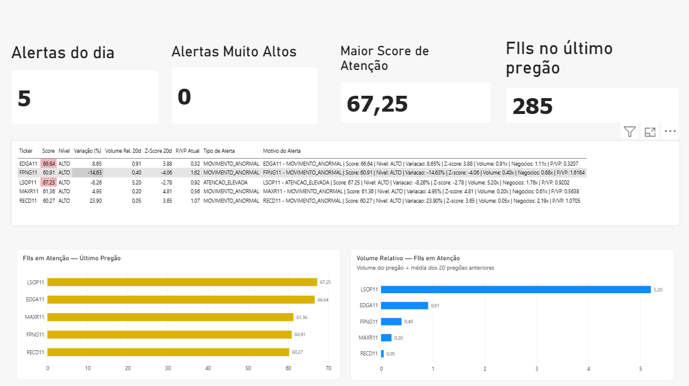

# FII Intelligence

Plataforma de dados para monitoramento de Fundos de Investimento Imobiliário (FIIs) brasileiros, desenvolvida como projeto de Engenharia e Análise de Dados.

O projeto integra dados oficiais da CVM e da B3, executa processos de ETL em Python, armazena os dados em PostgreSQL e calcula indicadores de mercado, métricas estatísticas, um Score de Atenção e alertas para identificar movimentações que merecem análise.

> O projeto possui finalidade educacional e analítica. O Score de Atenção não representa recomendação de compra ou venda de ativos.

---

## Objetivo

Responder diariamente à pergunta:

**"O que mudou hoje no mercado de FIIs e quais fundos merecem atenção?"**

A ideia é transformar diferentes fontes de dados do mercado em uma camada estruturada para análise, reduzindo a necessidade de acompanhamento manual de centenas de fundos.

---

## Arquitetura

```text
CVM + B3
   |
   v
Extração de dados
   |
   v
Python / ETL
   |
   v
Tratamento e validação
   |
   v
PostgreSQL
   |
   v
Indicadores de mercado
   |
   v
Score de Atenção
   |
   v
Alertas
   |
   v
Power BI
```

---

## Tecnologias

- Python
- Pandas
- PostgreSQL
- SQL
- SQLAlchemy
- psycopg2
- Requests
- BeautifulSoup
- Power BI
- PowerShell
- Windows Task Scheduler
- Git / GitHub

---

## Fontes de dados

### CVM

Utilizada como principal fonte para informações cadastrais e fundamentos dos fundos.

Entre os dados tratados estão:

- CNPJ do fundo e da classe
- administrador
- gestor
- patrimônio líquido
- situação cadastral
- dados mensais dos FIIs

### B3

Utilizada como principal referência para informações de negociação e mercado.

O projeto processa dados como:

- ticker
- preços de abertura, máxima, mínima e fechamento
- volume financeiro
- quantidade de negócios
- histórico de negociação

---

## Pipeline de dados

O pipeline principal é executado pelo arquivo:

```text
atualizar_fiis.py
```

Ele coordena 10 etapas:

1. Atualização cadastral da CVM
2. Extração de FIIs da B3
3. Tratamento de fundos sem classe
4. Associação segura de tickers B3 x CVM
5. Extração do histórico de cotações da B3
6. Carga das cotações no PostgreSQL
7. Extração dos fundamentos mensais da CVM
8. Carga dos fundamentos
9. Cálculo de indicadores e Score de Atenção
10. Geração de alertas

O processo foi desenvolvido para permitir reexecução sem duplicar os registros já armazenados.

---

## Associação B3 x CVM

Um dos desafios do projeto foi relacionar os tickers negociados na B3 com os registros oficiais da CVM.

A estratégia utiliza prioritariamente:

1. CNPJ da classe
2. CNPJ do fundo como fallback
3. validação de associações ambíguas

Tickers com associação ambígua não são vinculados automaticamente.

Essa abordagem evita atribuir um ticker a uma classe incorreta apenas para preencher o cadastro.

---

## Indicadores

A camada analítica calcula métricas como:

- variação percentual
- volume médio de 20 períodos
- volume relativo
- quantidade média de negócios
- negócios relativos
- volatilidade
- média das variações
- desvio das variações
- Z-Score
- liquidez
- P/VP
- Dividend Yield mensal da fonte cadastral/fundamental
- número de cotistas

---

## Score de Atenção

O projeto possui um indicador próprio chamado **Score de Atenção**, em escala de 0 a 100.

Ele combina sinais de mercado relacionados a:

- anormalidade do movimento de preço
- volume relativo
- quantidade relativa de negócios
- liquidez

Os fundamentos são utilizados como contexto adicional para análise.

O objetivo do score não é prever preço ou recomendar investimentos, mas priorizar quais FIIs apresentam comportamento que merece investigação.

---

## Alertas

Os fundos com níveis elevados de atenção podem gerar alertas classificados em categorias como:

- movimento anormal
- volume anormal
- negociação anormal
- múltiplos sinais
- atenção elevada

Os alertas são armazenados no PostgreSQL e disponibilizados para consumo pelo dashboard.

---

## Banco de dados

O PostgreSQL funciona como camada central da solução.

Principais tabelas:

```text
fiis
fiis_historico
fiis_sem_classe
cotacoes
fundamentos_fii
indicadores_fii
alertas_fii
```

Também foram criadas views específicas para consumo pelo Power BI.

---

## Automação

O pipeline é executado automaticamente em dias úteis utilizando:

```text
Windows Task Scheduler
        |
        v
PowerShell
        |
        v
executar_pipeline_diario.ps1
        |
        v
Python
        |
        v
atualizar_fiis.py
```

Cada execução gera um arquivo de log independente para auditoria e diagnóstico.

---

## Dashboard

### Visão geral do dashboard



O Power BI possui duas páginas principais.

### Radar do Mercado

Visão geral do último pregão, incluindo:

- quantidade de alertas
- alertas de nível muito alto
- maior Score de Atenção
- quantidade de FIIs analisados
- FIIs com maior Score de Atenção
- volume relativo
- motivos dos alertas

### Análise do FII

Permite selecionar um ticker e analisar:

- preço
- Score de Atenção
- P/VP
- variação
- volume relativo
- liquidez
- nível de atenção
- comportamento histórico

---

## Validação do MVP

O pipeline foi validado de ponta a ponta com:

- conexão com PostgreSQL
- atualização das fontes
- cargas idempotentes
- validação de duplicidades
- cálculo de indicadores
- geração de scores
- geração de alertas
- execução automática
- geração de logs
- atualização do dashboard

Em uma das validações do último pregão processado:

```text
285 FIIs com cotação
285 registros de indicadores
283 FIIs com Score de Atenção calculável
5 alertas gerados
0 duplicidades por data + ticker
```

Casos sem dados estatísticos suficientes permanecem sem score em vez de receber artificialmente valor zero.

---

## Limitações atuais

- O vínculo histórico dos fundamentos ainda utiliza a data de referência da CVM e não implementa controle rigoroso de disponibilidade temporal pela data de entrega/publicação.
- O Dividend Yield mensal da CVM é utilizado como contexto fundamental e não representa necessariamente um evento efetivo de dividendo pago por cota.
- A atualização do Power BI Service permanece manual no MVP porque o gateway local depende de permissão do ambiente institucional.
- O arquivo anual de histórico de cotações da B3 ainda é reprocessado durante a atualização; uma evolução futura é tornar essa etapa incremental.

---

## Estrutura do projeto

```text
Projeto_fiis/
├── docs/
│   └── dashboard-radar.png
├── src/
│   ├── b3/
│   ├── extract/
│   ├── transform/
│   └── load/
├── sql/
├── atualizar_fiis.py
├── executar_pipeline_diario.ps1
├── requirements.txt
├── .env.example
├── .gitignore
└── README.md
```

---

## Próximas evoluções

- dados de dividendos efetivamente anunciados/pagos
- evolução do modelo de Score de Atenção
- controles adicionais de qualidade de dados
- processamento incremental das cotações
- documentação visual da arquitetura
- automação da atualização do Power BI Service quando houver infraestrutura compatível
- evolução do projeto para uma plataforma de inteligência de mercado

---

## Autor

Projeto desenvolvido por **Jonatas Borges** como parte de um portfólio em **Análise e Engenharia de Dados**, combinando conhecimentos em Economia, mercado financeiro, Python, SQL, PostgreSQL e Power BI.